# 04 — Ajustes generales

Una vez instalada la base de datos, haremos los ajustes generales que permiten adaptar la instancia de Odoo a las necesidades del proyecto, mejorar la experiencia de usuario y reforzar la seguridad del entorno.

A continuación se detallan los principales aspectos que conviene revisar tras la instalación:

- Activar notificaciones y (opcional) PWA.
- Perfil: modo oscuro, datos, 2FA, firma email, notificaciones en Odoo.
- Usuarios y compañías.
- Idiomas y diseño de documentos.
- Emails de resumen: periodicidad y destinatarios.

## Pasos

### 1. Activar notificaciones y PWA

Estando en el panel principal de Odoo, en la zona superior derecha, observarás un icono de mensajes (representado por un bocadillo de diálogo). Al hacer clic sobre él, se desplegarán varios mensajes informativos, entre los que se incluyen:

* La opción para habilitar las notificaciones del navegador, que permiten recibir alertas en tiempo real sobre tareas, mensajes o eventos.

  
* La opción para instalar Odoo como aplicación de escritorio (PWA), lo que permite acceder al sistema como si fuera una app nativa, con icono propio y sin barra de navegación. Esta opción es opcional.

  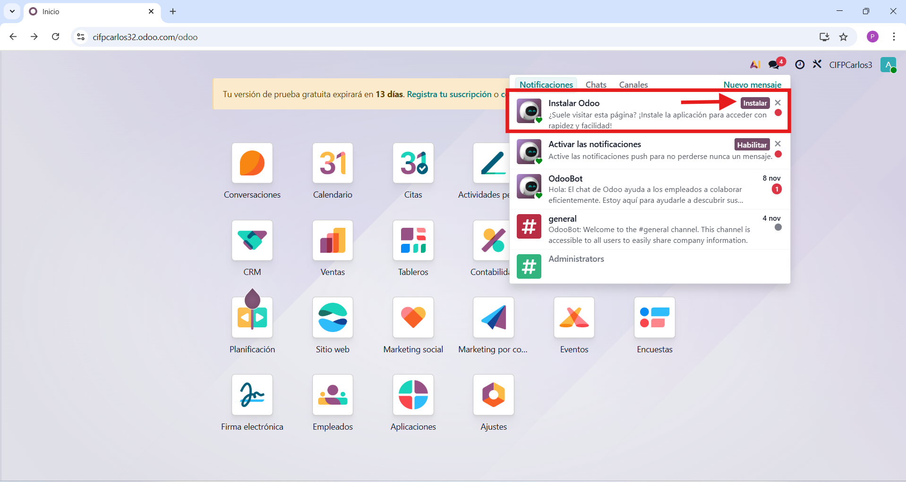

### 2. Perfil

**Modo oscuro**

Estando en el panel principal de Odoo , dirígete a la esquina superior derecha, donde aparece una letra "A". Al hacer clic sobre ella, se desplegará un menú con varias opciones. Selecciona “My Preferences” para acceder a la configuración personal del perfil.

Desde esta sección podrás poner el modo oscuro y no olvides darle a "Update Preferences".

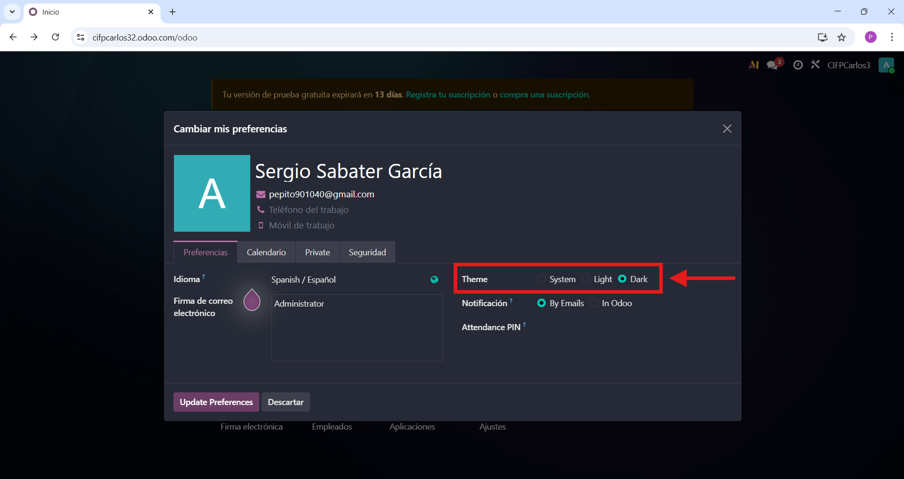

**Datos**

Dentro del apartado “My Preferences”, es recomendable revisar y actualizar los datos personales del usuario para garantizar que la información del sistema esté correctamente asociada a cada cuenta, incluyendo campos como nombre, correo electrónico, idioma y zona horaria. Pudiendo añadir teléfono de trabajo, móvil de trabajo, dirrección privada, teléfono privado, correo electrónico privado y contacto de emergencia en la pestaña "Private".

**2FA**

Para activar la autenticación en dos pasos (2FA) en Odoo, primero accede al panel principal y dirígete a la esquina superior derecha, donde aparece la letra “A”. Haz clic sobre ella y selecciona la opción “My Preferences”.

Dentro de esta sección, selecciona el apartado “Seguridad”. Allí verás la opción “Autenticación de dos factores” (2FA), que puedes activar para reforzar la seguridad de tu cuenta.

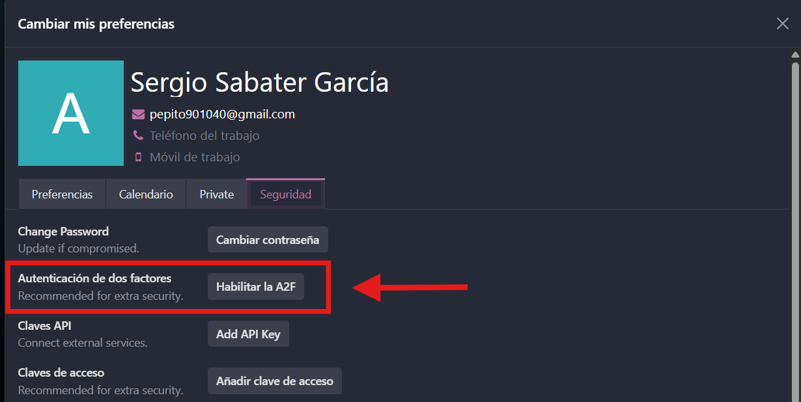

Tras darle a "Habilitar la A2F" te pedira la contraseña

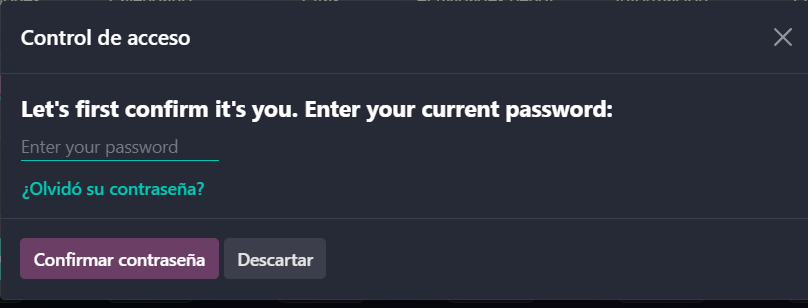

Luego de poner la contraseña se mostrará un código QR que deberás escanear con una aplicación de autenticación. Una vez escaneado, introduce el código temporal generado por la app en el campo correspondiente y se activará la autenticación en dos pasos.

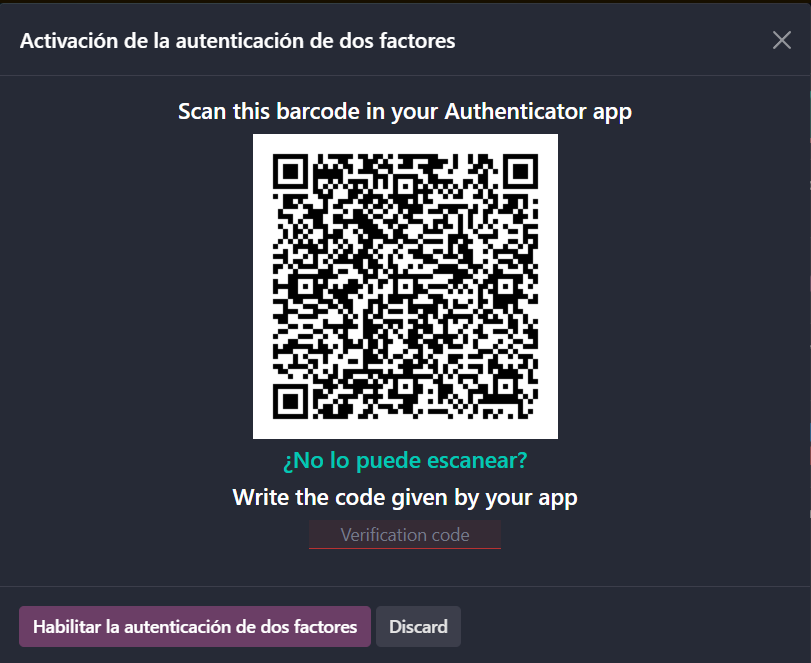

Desde ese momento, cada vez que inicies sesión en Odoo se te pedirá el código de verificación, lo que añade una capa extra de protección frente a accesos no autorizados.

**Firma email**

Dentro del apartado “My Preferences”, Odoo permite personalizar la firma de correo electrónico que se incluirá automáticamente al final de los mensajes enviados desde el sistema.

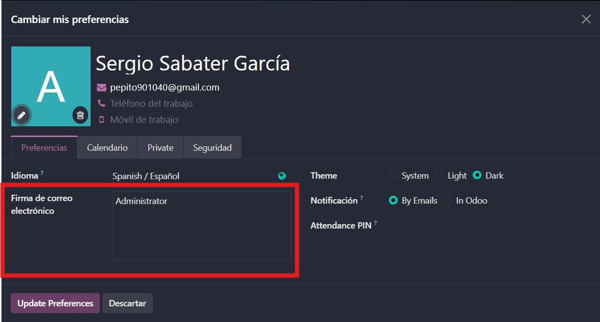

**Notificaciones en Odoo**

Dentro de “My Preferences”, puedes configurar cómo recibir las notificaciones internas, eligiendo entre gestionarlas directamente dentro de Odoo o recibirlas por correo electrónico, según tu preferencia de trabajo.

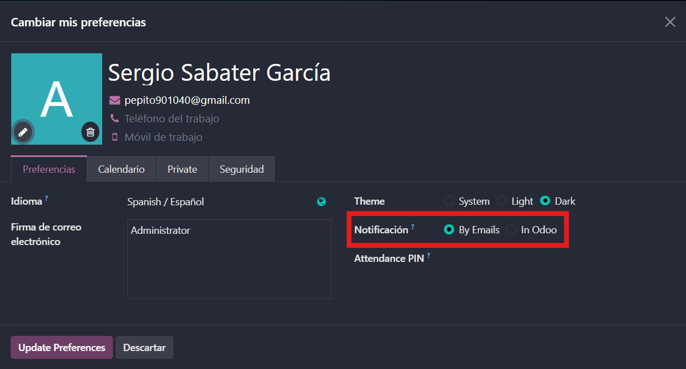

### 3. Usuarios y compañías

Desde el menú principal, accede al módulo “Ajustes” y arriba a la izquierda dirígete a las secciones “Ususarios y Compañías” para gestionar el acceso y la estructura organizativa del sistema.

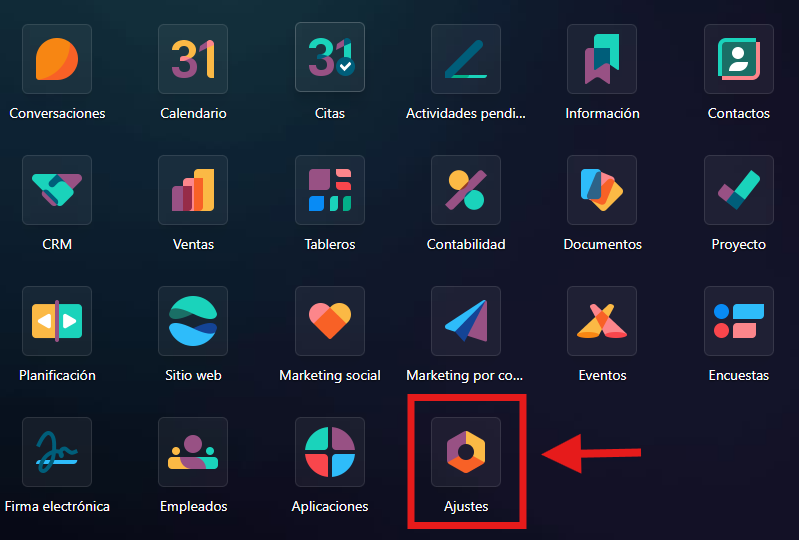

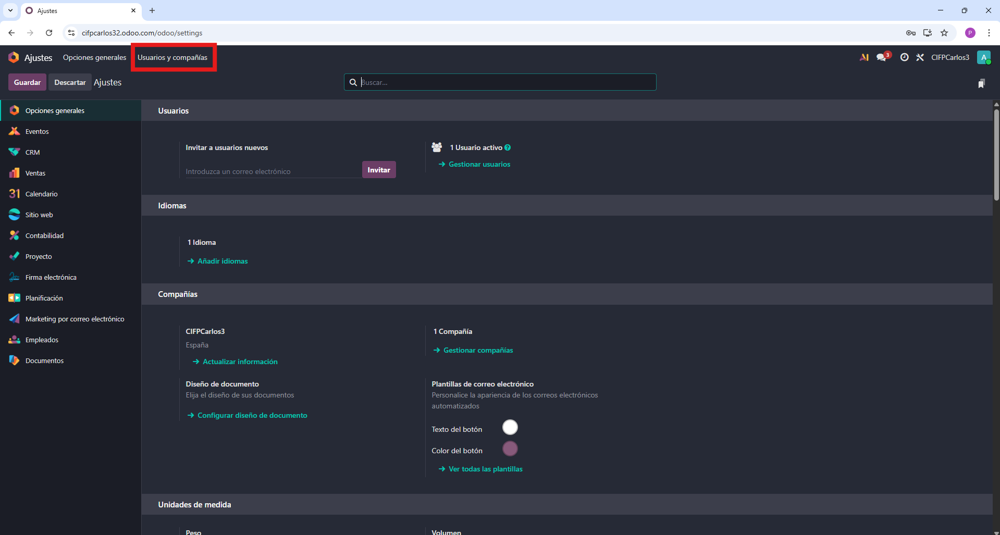

**Compañías**

Odoo permite gestionar múltiples compañías dentro de una misma. Se añade una nueva compañía dandole a "Compañías". Luego estarás en la ventana de "Compañías", donde podrás añadir nuevas compañías y completa los datos fiscales, logotipo y configuración básica de la entidad.

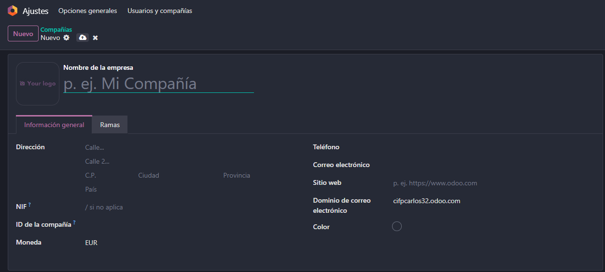

**Usuarios**

Odoo permite gestionar múltiples usuarios con distintos roles y permisos. Se añade un nuevo usuario dándole a “Usuarios”. Luego estarás en la ventana de “Usuarios”, donde podrás crear nuevos usuarios y completar su nombre, correo electrónico, compañía asignada y nivel de acceso.

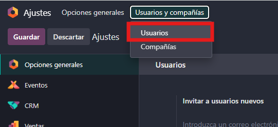

### 4. Idiomas y diseño de documentos

**Idiomas**

Odoo permite trabajar con diferentes idiomas en la interfaz; para añadir uno nuevo, ve a Ajustes , accede al apartado “Idiomas” y pulsa “Añadir idiomas” para instalar el idioma deseado en el sistema.

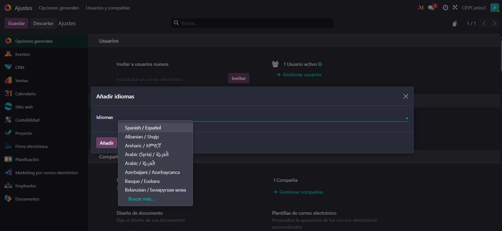

Idioma instalado

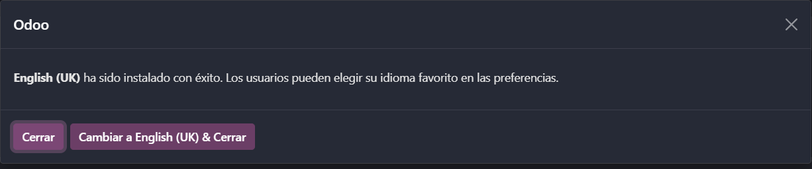

Cuando se ha agregado el nuevo idioma, el usuario puede cambiarlo en su perfil.

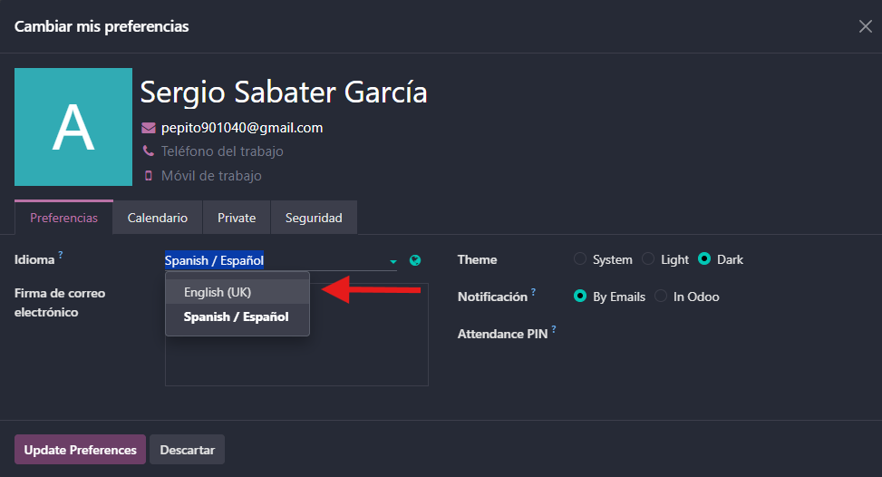

**Diseño de documentos**

Odoo permite personalizar el diseño de documentos como presupuestos y facturas; para hacerlo, ve a Ajustes, accede al apartado “Diseño de documentos” y selecciona la plantilla que mejor se adapte a tu empresa.

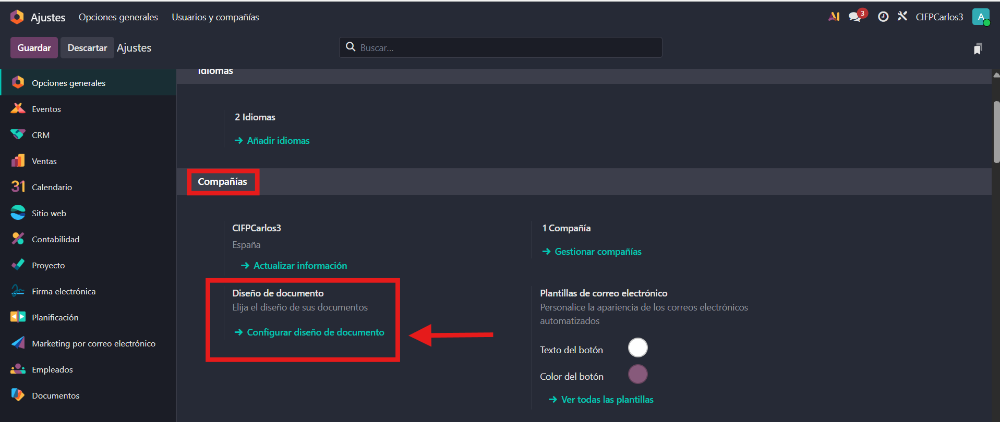

### 5. Emails de resumen

Odoo permite configurar el envío de emails de resumen con información relevante. Para activarlos, ve a Ajustes, accede al apartado “Emails de resumen” y define la periodicidad, el contenido y los destinatarios según tus necesidades.

**1. Personalización de la Periodicidad (Frecuencia de Envío)**

Puedes decidir con qué frecuencia deseas recibir el resumen; por defecto, Odoo lo envía diariamente, pero puedes modificar la periodicidad y configurarlo como semanal o mensual según tus necesidades.

**2. Configuración de destinatarios del correo**

Odoo permite gestionar quién recibe los correos de resumen; además del usuario principal, puedes configurar destinatarios adicionales para que otras personas también reciban estos informes automáticamente.

