# 05 — Integración con Gmail (OAuth GCP + Add-on)

## Requisitos

- Cuenta Google Cloud (GCP).

## Pasos resumidos

### 1. Activar plugin de correo en Odoo e instalar Odoo Inbox Add-on en Gmail.

* Primero nos vamos a los ajustes generales, al apartado de integraciones.
* Activamos la opción Plugin de correo y guardamos los cambios.
  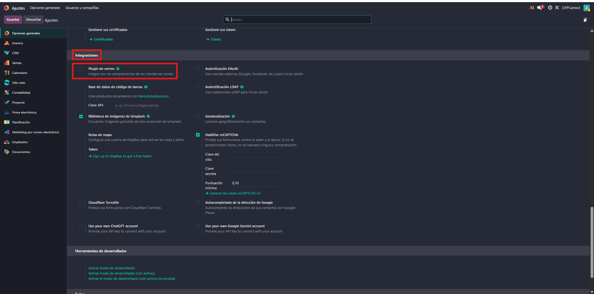

  
* En Gmail, hacemos clic en el botón de más (+) para buscar el complemento.
  
* Instalamos Odoo Inbox Add-on y concedemos los permisos..

  

  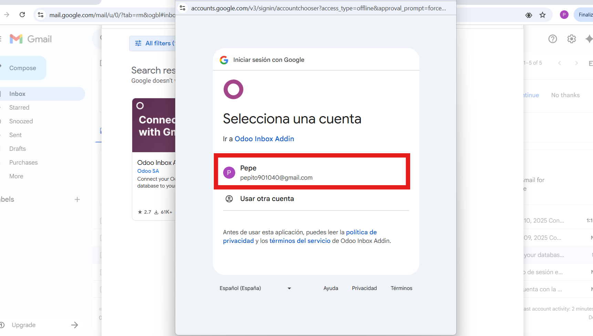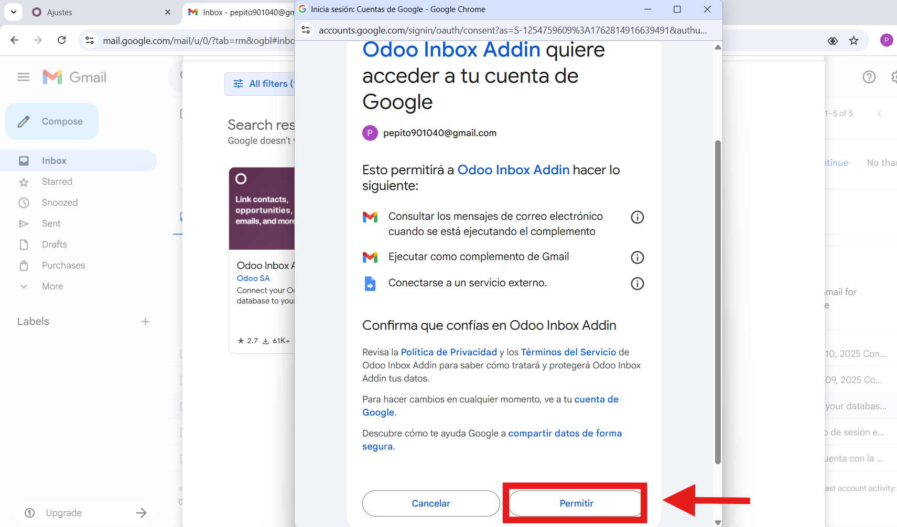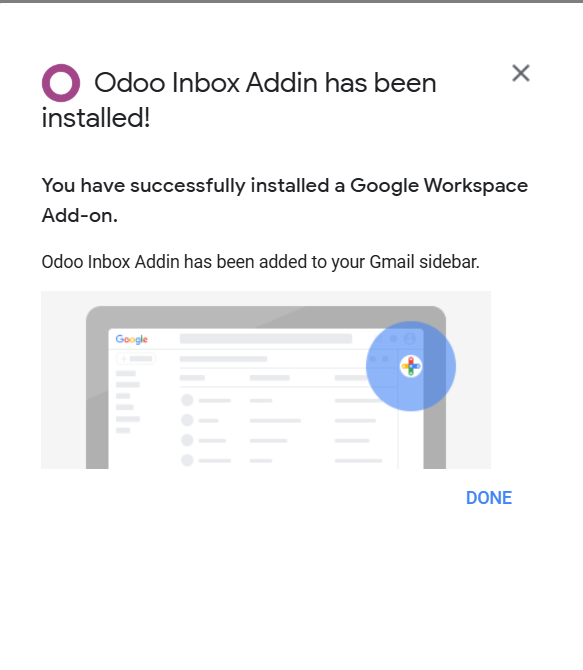

  

  

### 2. En Google Cloud Console: habilitar Gmail API, crear OAuth Client (Web), configurar redirect URI de Odoo.

**Acceso a OAuth en Odoo.**

* Primero activamos la autenticación OAuth y guardamos.
  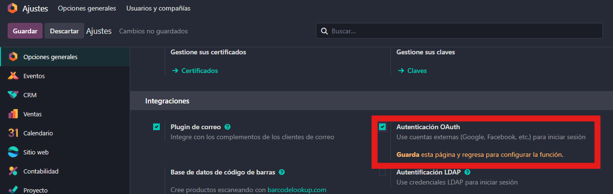
* Ahora le damos a proveedores OAuth y le daremos a GoogleOAuth2.

  

  

**Creación del Proyecto en Google console cloud.**

* Buscamos por el navegador "Google console" y le daremos donde pone Google Cloud console.

  
* Accedemos a Google Cloud Console y creamos un nuevo proyecto.

  

  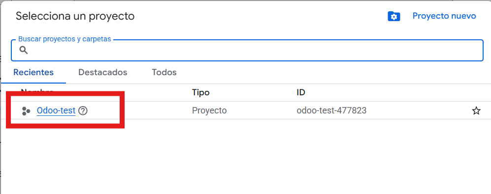

**Habilitación de API.**

* Busca,os en el buscador del proyecto "gmail" y le damos a gmail API, que es la API que queremos habilitar.

  

  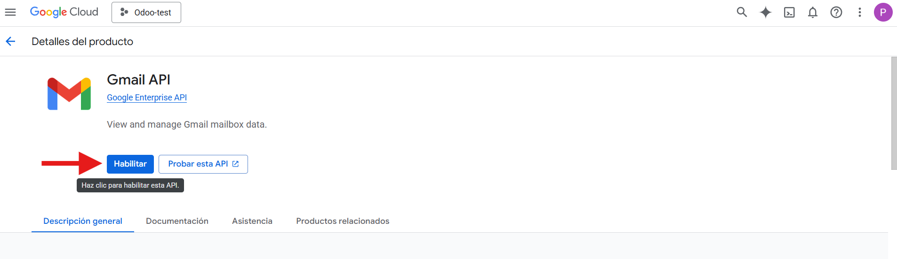

**Creación de Credenciales.**

* Seleccionamos "Crear credenciales" y después "datos del usuario" y a siguiente y rellenamos los datos que nos piden y continuamos.

  

  
* Ahora le damos permisos que queremos concederle a Odoo como leer, redactar y enviar correos a tu nombre. Le damos a actualizar y guardamos y continuamos.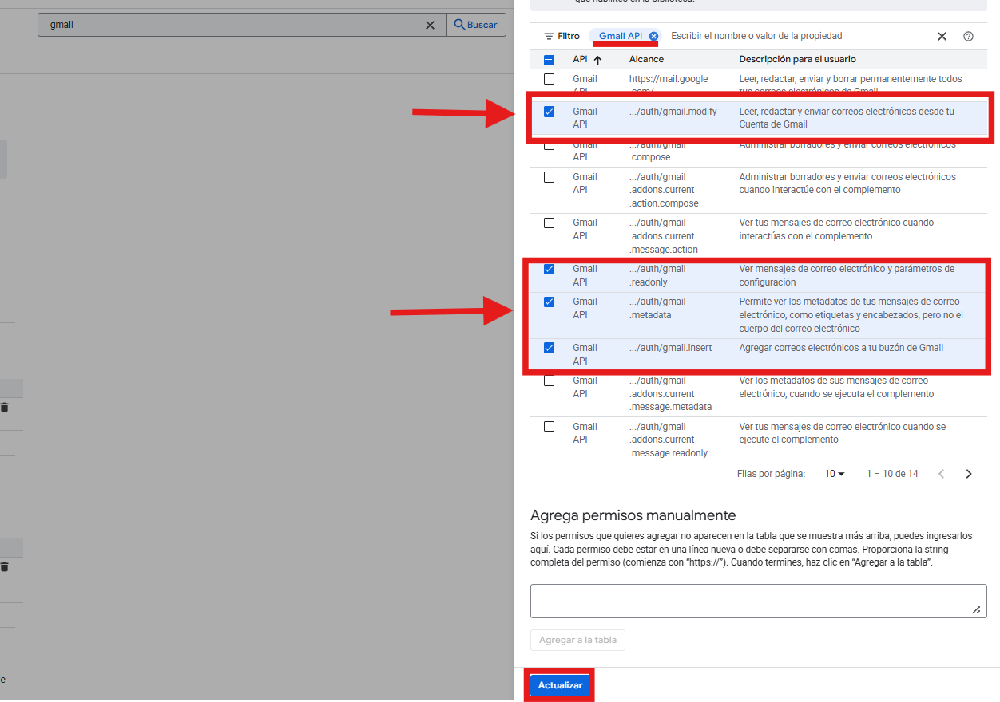
* Le añadimos el tipo de aplicación, nosotros le pondremos "Aplicación Web" y como nombre "odoo.email" y añadiremos la URL de redireccionamiento autorizada y le damos a crear.

  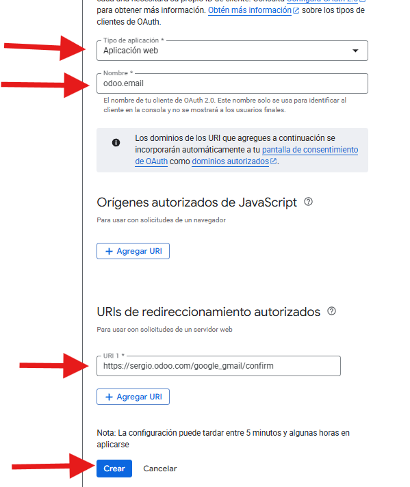

### 3. Copiar Client ID/Secret a Odoo (Gmail server settings) y Guardar.

**Copiamos el Client ID y el Client Secret generados en GCP.**

* Nos vamos a credenciales y dentro pulsamos nuestra cuenta.

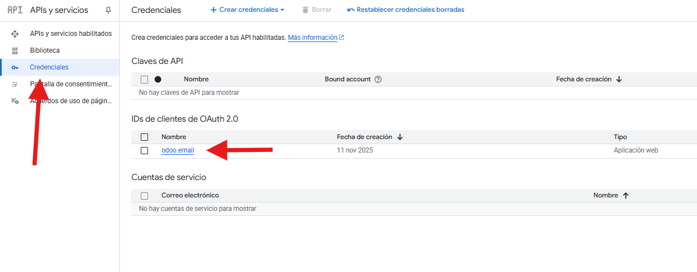

* Dentro estará nuestro ID del cliente y el secreto del cliente.

  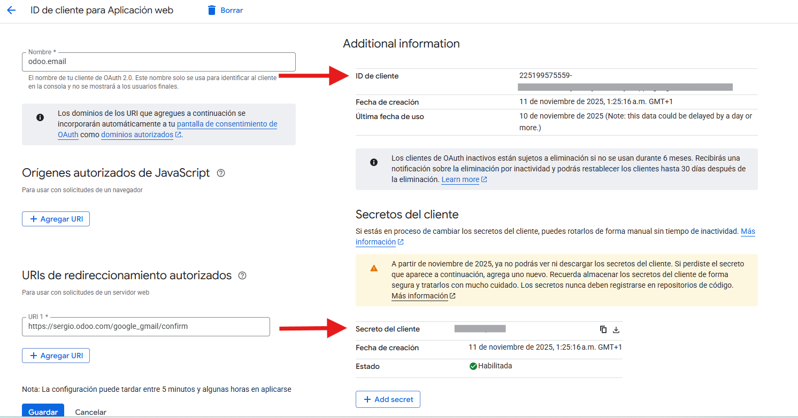
* Copiamos nuestro ID de cliente, nos vamos a Odoo, lo pegamos, le damos a permitido y guardamos.

  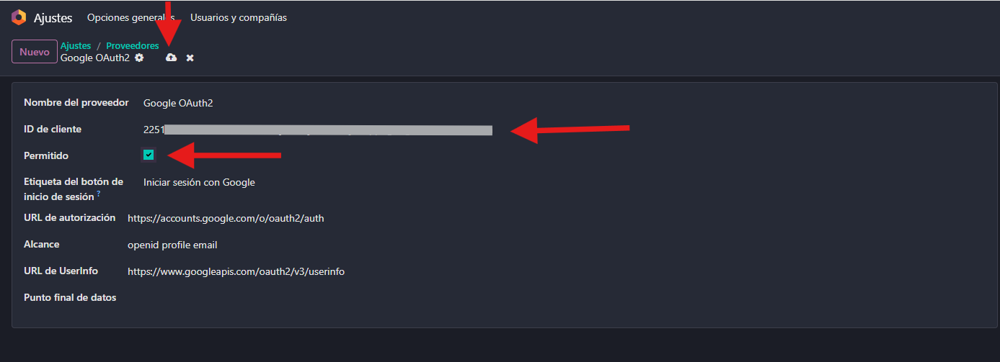
* Nos vamos a ajuste, al apartado de correos electronicos y activamos "Utilizar servidores de correo electrónico personalizados", ponemos el ID del cliente y el secreto del cliente y lo guardamos.

  

### 4. Probar desde Gmail: crear contacto/oportunidad desde el add-on.

* Cuando estás en Gmail y abres un correo electrónico, puedes añadir directamente un contacto, una oportunidad o consultar la información de la empresa desde la barra lateral del complemento Odoo Inbox Add-on.

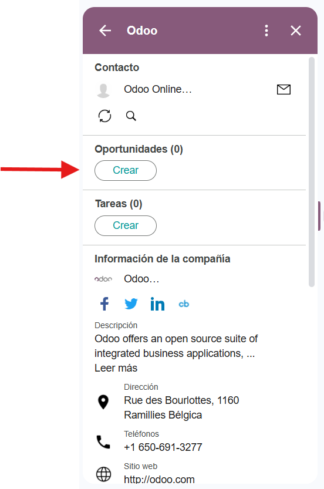

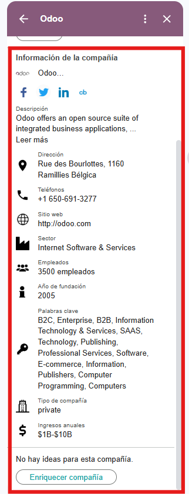
