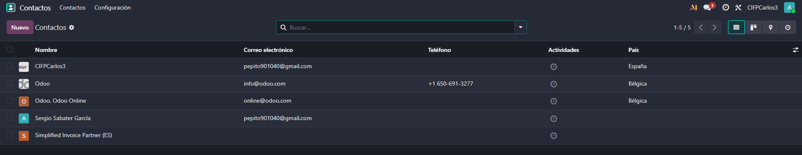
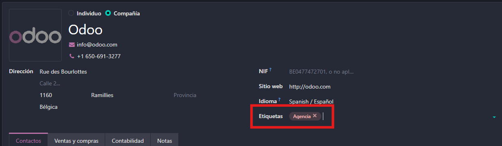
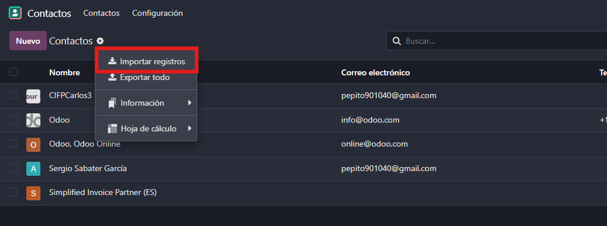
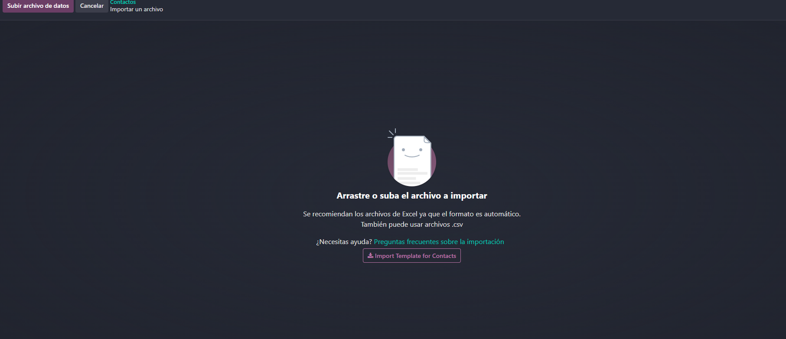
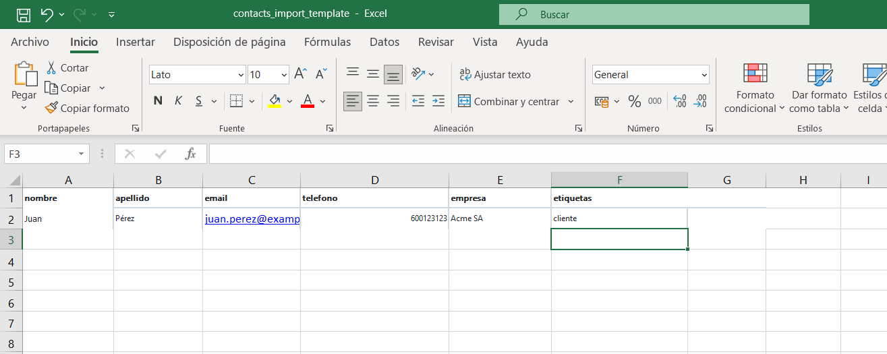

# 06 — Contactos

El módulo de Contactos en Odoo permite centralizar toda la información de personas y empresas con las que interactúa una organización, facilitando su uso en ventas, CRM, facturación y más.

## Asociación automática persona/empresa.

En Odoo, la asociación automática entre persona y empresa es una funcionalidad clave del módulo de Contactos que permite mantener una estructura jerárquica clara y evitar registros aislados o mal vinculados.

La asociación automática entre persona y empresa en Odoo realiza varias acciones clave que mejoran la organización de los contactos:

1. **Detecta el tipo de contacto**

Al crear un nuevo contacto, Odoo distingue si es una persona o una empresa según el campo “Tipo”.

2. Permite vincular la persona a una empresa

Si seleccionas “Persona”, puedes indicar a qué empresa pertenece.

Odoo asocia automáticamente esa persona dentro de la ficha de la empresa.

3. **Agrupa jerárquicamente los contactos**

En la vista de la empresa, aparece una pestaña llamada “Contactos y direcciones” donde se listan todas las personas vinculadas.

Esto crea una estructura clara y navegable.

4. **Hereda datos de la empresa si no se especifican**

Si el contacto tipo persona no tiene dirección o teléfono, puede heredar esos datos de la empresa asociada.

5. **Evita registros aislados o mal vinculados**

Gracias a esta asociación, se mantiene la coherencia de la base de datos y se facilita la trazabilidad comercial.

## Etiquetas para segmentar.

Las etiquetas en Odoo son una herramienta esencial para segmentar y organizar los contactos.

Permiten clasificar personas y empresas según criterios como tipo de cliente, ubicación o prioridad, y se pueden crear y aplicar fácilmente desde la ficha del contacto.

Gracias a su integración con el buscador, las etiquetas facilitan la localización rápida de registros y mejoran la productividad en tareas comerciales y administrativas.

## Importación CSV

La importación de contactos por CSV en Odoo permite cargar registros masivos de forma rápida y estructurada, usando una plantilla que define los campos esperados.

En algunos casos, Odoo no identifica automáticamente todos los campos del archivo CSV, por lo que será necesario asignarlos manualmente. Una vez que todos los campos estén correctamente configurados, basta con hacer clic en “Importar” (arriba a la izquierda) para completar el proceso y cargar los contactos en el sistema.

