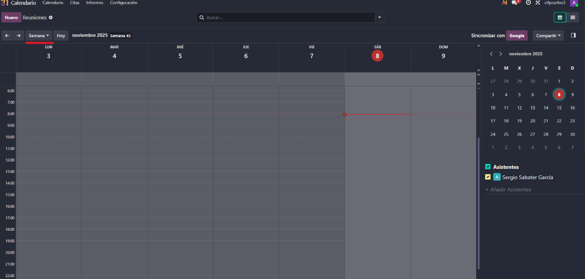
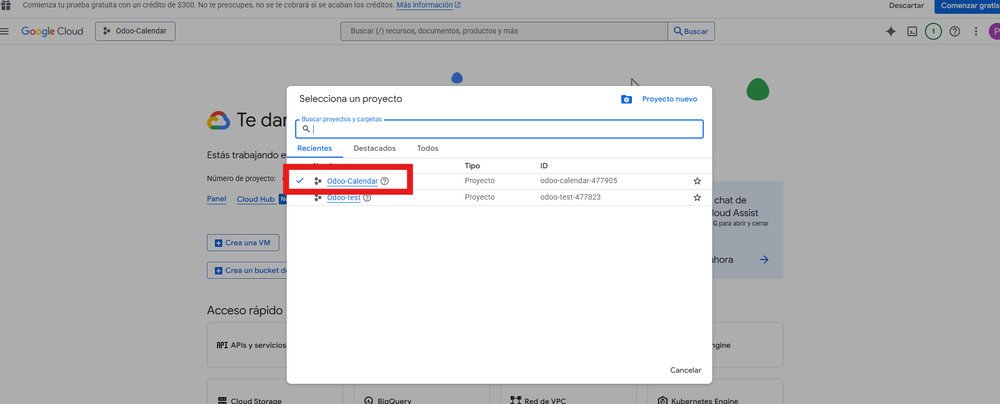
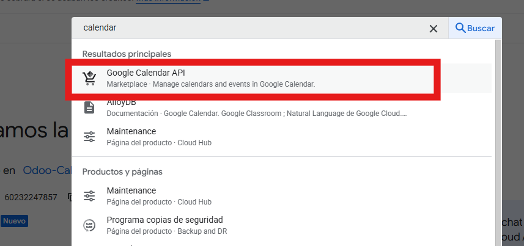
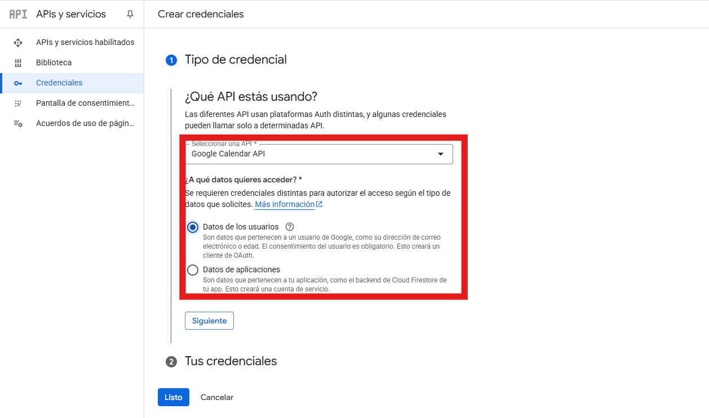
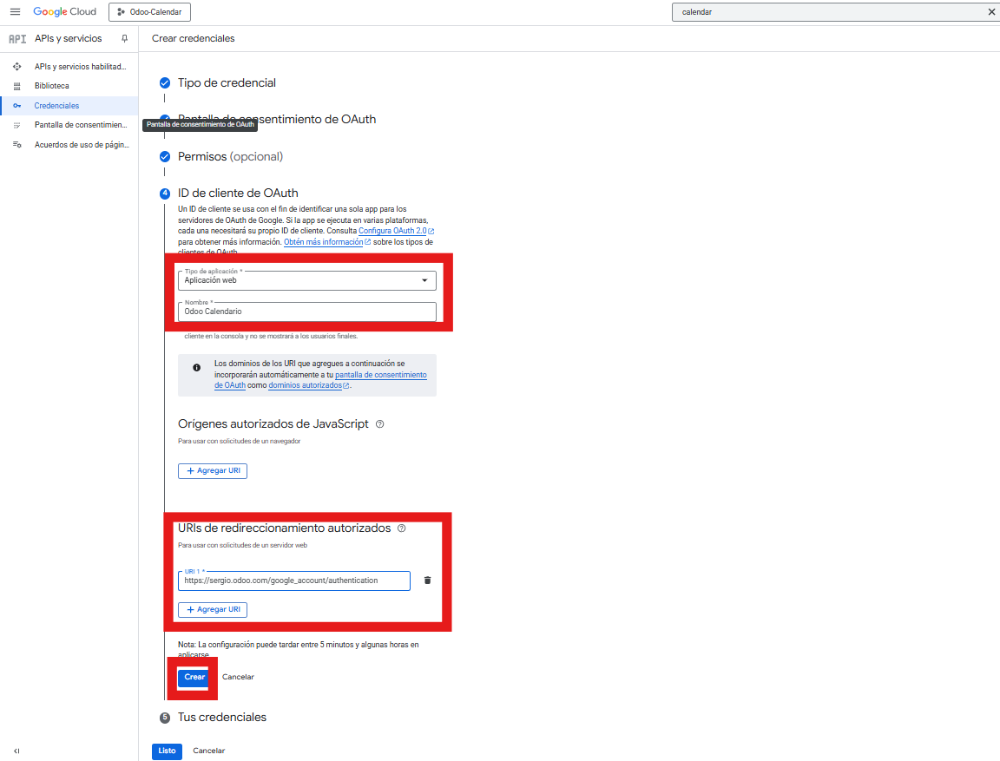
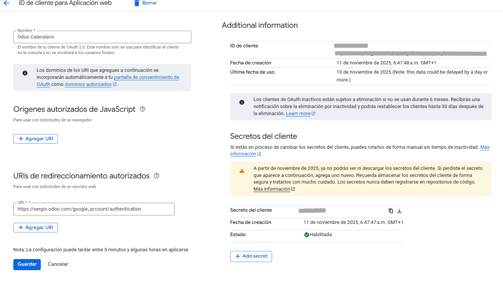
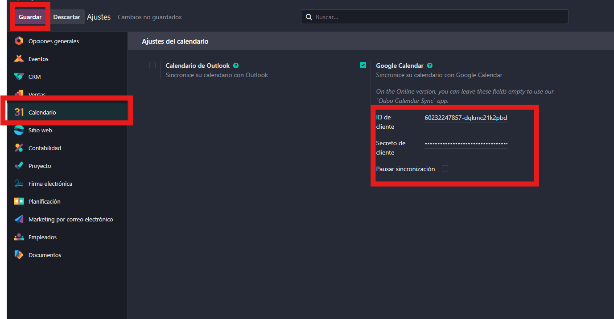
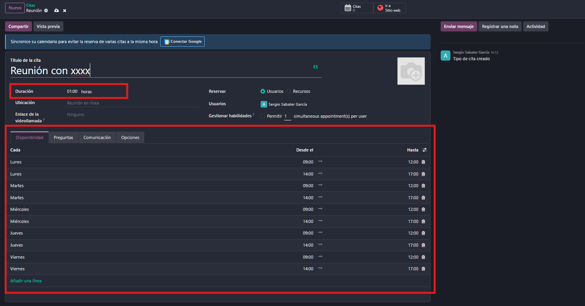
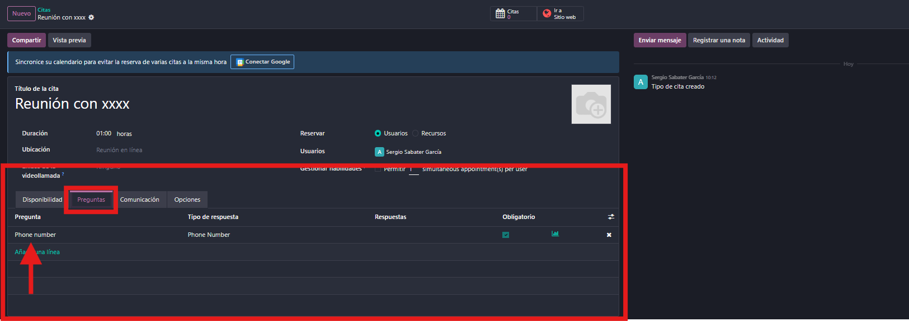

# 07 — Calendario y Citas

El módulo de Calendario en Odoo permite gestionar eventos, reuniones y disponibilidad del equipo de forma visual y sincronizada.

## Calendario (día/semana/mes) + disponibilidad del equipo.

Odoo ofrece una vista de calendario en formato día, semana o mes, donde se pueden consultar y crear eventos fácilmente.

Cada usuario puede consultar su calendario y el de su equipo, visualizando en tiempo real la disponibilidad de todos para planificar reuniones de forma eficiente.

## Integración con Google Calendar (API OAuth GCP).

Siguiendo el mismo procedimiento que con Gmail, entramos en Google Cloud Console, iniciamos un proyecto nuevo, localizamos la Google Calendar API y la habilitamos.

* Creamos un nuevo proyecto que se llamará Odoo-Calendar.
  
* Luego buscamos la API de Calendar y lo habilitamos.
  
* Creamos credenciales como en la API de gmail, le damos a "Datos de los usuarios" y a siguiente.
  
* Rellenamos los datos como en integracion gmail.
  
* Le damos permisos como en el gmail, filtrandro por el buscador Calendar y activamos todos los permisos.  Que no se te olvide actualizar.

  
* Después relleno el ultimo apartado muy parecido a lo que hicimos en gmail.

  

  
* Nos vamos a ajustes de calendario y rellenamos los apartados donde pone ID de cliente y Secreto del cliente.

  

## Odoo Meet (videollamadas) o enlaces externos.

Al programar un evento en el calendario de Odoo, el sistema permite integrar videollamadas de forma sencilla:

**Enlaces externos**

En el campo “URL de llamada”, puedes insertar el enlace de cualquier plataforma externa como Zoom, Google Meet o Microsoft Teams.

**Odoo Meet**

También es posible utilizar la opción nativa “Reunión de ODU”, que habilita la videollamada directamente dentro de Odoo, sin necesidad de recurrir a servicios externos.

## Módulo Citas (Enterprise): enlaces públicos, buffers, preguntas previas.

El módulo Citas de Odoo (disponible en la edición Enterprise) permite que clientes, proveedores o cualquier usuario externo puedan reservar reuniones directamente desde un enlace público , sin necesidad de contacto previo.

**Tipos de cita.**

* Reunion
* Videollamda
* Reserva de mesa
* Reserva de recursos
* Consultas pagadas
* Asientos pagados

  

**Configuración de Duración y Buffers (Margen de Tiempo)**

Dentro de la configuración de la cita, puedes definir cómo se gestionará el tiempo:

• Duración: Define cuánto tiempo van a durar estas citas.

• Buffer (Margen de Tiempo): Puedes establecer cada cuánto se puede crear un espacio.

**Enlaces publicos**

Para generar un enlace público de cita en Odoo, primero accede al módulo Citas desde el panel principal. Allí puedes crear un nuevo tipo de cita o seleccionar uno ya existente.

Cuando hayas completado la configuración, guarda el tipo de cita. Luego, haz clic en el botón “Compartir”. Odoo mostrará una ventana con la URL generada, que puedes copiar con el botón “Copiar enlace y cerrar”. Este enlace puede compartirse por correo electrónico, página web, redes sociales o cualquier otro canal, permitiendo que usuarios externos reserven citas directamente según la disponibilidad definida.

**Preguntas previas**

Odoo permite personalizar el proceso de reserva añadiendo preguntas que el usuario debe responder antes de confirmar la cita. Esta funcionalidad es especialmente útil para recopilar información clave que facilite la preparación de la reunión o la asignación adecuada del responsable.

