# 08 — Proyectos (Kanban)

El módulo Proyectos de Odoo permite organizar, planificar y supervisar el trabajo de forma visual y colaborativa. Utiliza una estructura basada en etapas y tareas, que se representa mediante un sistema tipo Kanban , ideal para equipos que gestionan múltiples procesos simultáneamente.

## Proyectos, etapas, tareas, subtareas.

### Proyectos

Los proyectos en Odoo agrupan tareas relacionadas con un objetivo común. Al crear un proyecto, se puede:

* Definir si será facturable o no.
* Asociarlo a un cliente registrado en el módulo de Contactos.
* Establecer una fecha de inicio y una fecha límite.
* Activar funcionalidades como tareas recurrentes, dependencias o hitos desde los ajustes.

  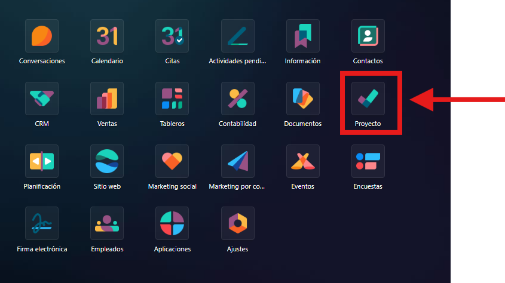

  

  

### Etapas

Las etapas representan el flujo de trabajo dentro de un proyecto.

El usuario puede crear, renombrar o reorganizar las etapas según las necesidades del equipo. Cada etapa se muestra como una columna en la vista Kanban, y las tareas se pueden mover entre ellas mediante arrastrar y soltar.

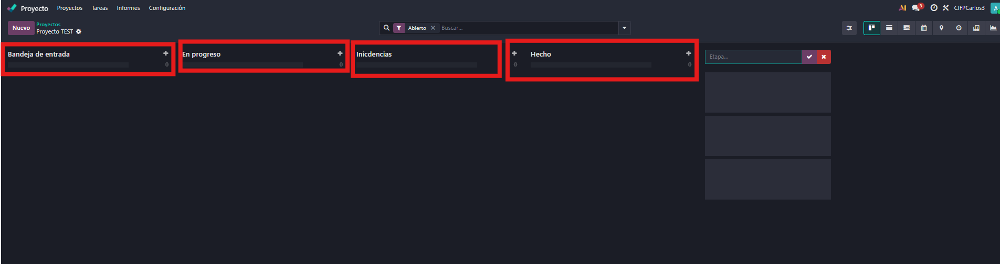

### Tareas

Las tareas son las unidades de trabajo dentro de un proyecto. Se crean directamente en una etapa y pueden incluir:

* Descripción detallada
* Etiquetas y prioridad
* Cliente asociado
* Fecha límite
* Responsable asignado

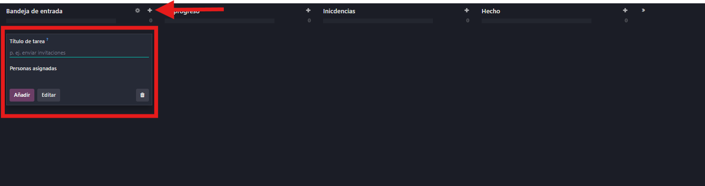

### Subtareas

Dentro de una tarea, es posible crear subtareas para dividir el trabajo en partes más pequeñas.

Las subtareas pueden tener su propia fecha límite, prioridad y responsable. Aunque Odoo permite anidar subtareas dentro de otras, se recomienda mantener una estructura clara y manejable.

## Tareas recurrentes, dependencias, hitos.

### Tareas recurrentes

* Esta funcionalidad debe activarse previamente en los ajustes del módulo Proyectos.
* Una vez habilitada, permite configurar tareas que se repitan automáticamente con una frecuencia definida: diaria, semanal, mensual o anual.
* Se puede establecer si la recurrencia será indefinida o tendrá una fecha de finalización.

### Dependencias

* También requiere activación en los**ajustes del proyecto** .* Permite definir qué tareas deben completarse antes de iniciar otras.
* Una tarea puede marcarse como “bloqueada por” otra, y mientras no se cumpla la condición, quedará en estado “en espera".
* Esta funcionalidad es clave para mantener la secuencia lógica del trabajo y evitar solapamientos.

### Hitos

* Los hitos representan eventos clave dentro del proyecto, como entregas parciales, revisiones o lanzamientos.
* Se pueden activar desde los ajustes y configurar como elementos independientes o como tareas especiales.
* Aunque Odoo permite crear hitos explícitos, también es común utilizar tareas específicas para marcar momentos importantes del proyecto.

## Vistas: tarjetas, lista, calendario propio.

El módulo Proyectos de Odoo ofrece varias formas de visualizar las tareas, lo que facilita el seguimiento del trabajo según las preferencias del usuario o el tipo de proyecto. Las tres vistas principales son: Kanban (tarjetas), lista y calendario interno, cada una con ventajas específicas.

### Tarjetas (Kanban)

* Es la vista por defecto del módulo, basada en el modelo Kanban.
* Las tareas se muestran como**tarjetas dentro de columnas** , que representan las etapas del proyecto.
* Cada tarjeta incluye información clave como el cliente, etiquetas, responsable, prioridad y fecha límite, sin necesidad de abrirla.
* Las tareas se pueden mover entre etapas mediante**arrastrar y soltar** , lo que facilita la gestión visual.

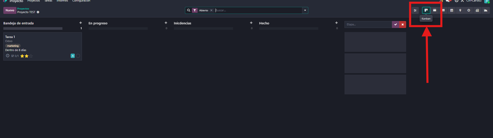

### Lista

* Esta vista muestra las tareas en formato**tabular** , permitiendo ordenar, filtrar y agrupar según distintos criterios.
* Es útil para revisar grandes volúmenes de tareas, editar campos rápidamente o aplicar filtros por etiquetas, fechas o responsables.
* Se pueden añadir columnas personalizadas para mostrar más información relevante.

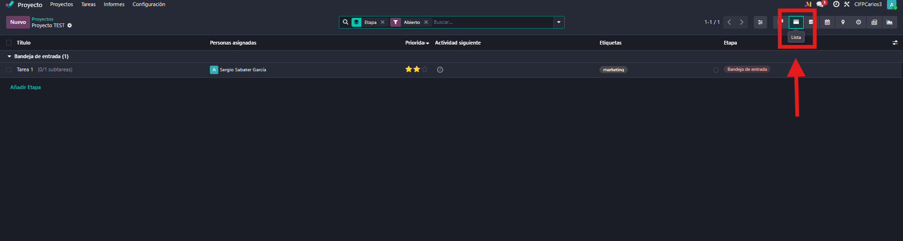

Calendario propio

* El módulo Proyectos incluye su propia vista de calendario, independiente del calendario general de Odoo.
* Permite visualizar las tareas según su fecha de vencimiento o planificación.
* Es especialmente útil para detectar tareas atrasadas, pendientes o recurrentes, tanto propias como del equipo.
* Esta vista ayuda a calendarizar los proyectos por separado, manteniendo el enfoque específico de cada módulo.

  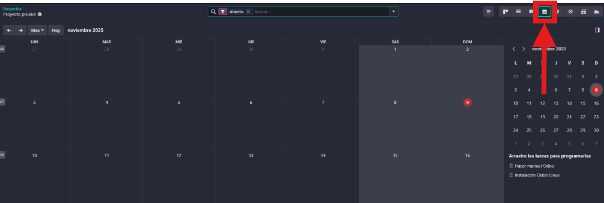

## Registro rápido de actividades y calificación del cliente.

### Registro rápido de actividades

Para consultar rápidamente las tareas disponibles, basta con acceder al módulo Proyectos y hacer clic en la pestaña superior Tareas. Desde allí, el sistema permite elegir entre:

* Mis tareas: muestra únicamente las tareas asignadas al usuario actual.

  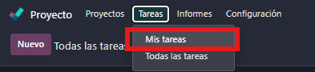

  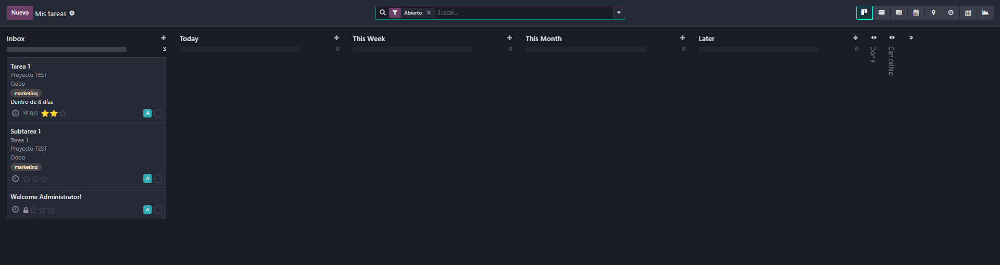
* Todas las tareas: ofrece una vista completa de todas las tareas del proyecto, independientemente del responsable.

  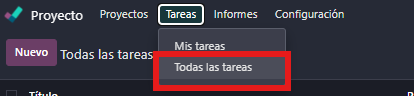

  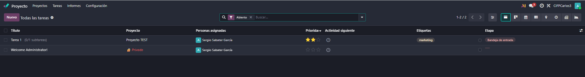

### Calificación del cliente

Para consultar la calificación del cliente, hay que acceder al módulo Proyectos y hacer clic en la pestaña superior "Informes" y elegir "Calificación del clientes" .

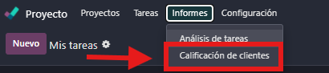

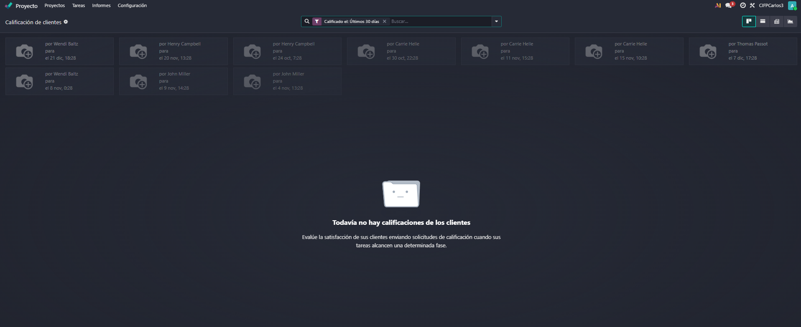

