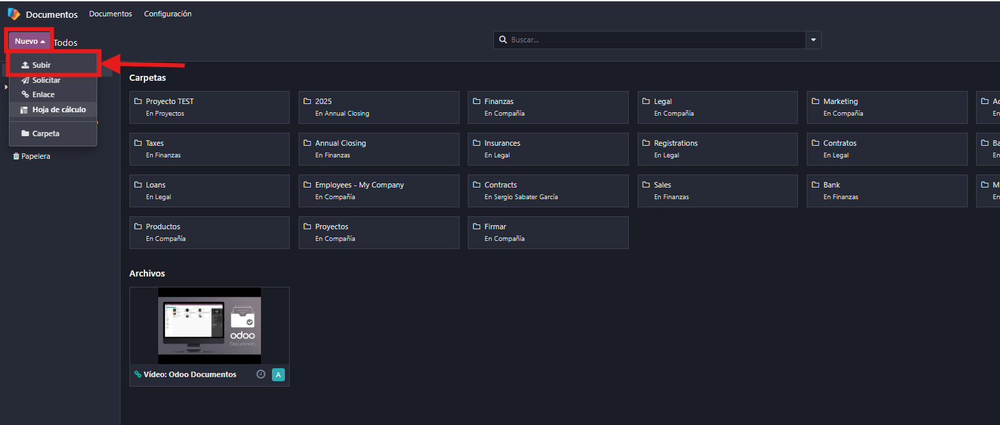
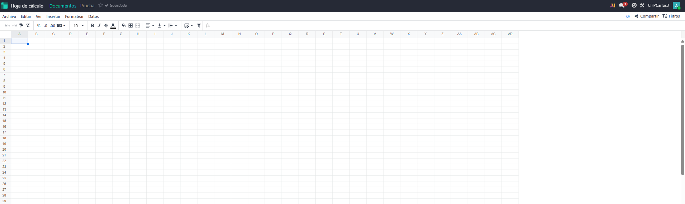
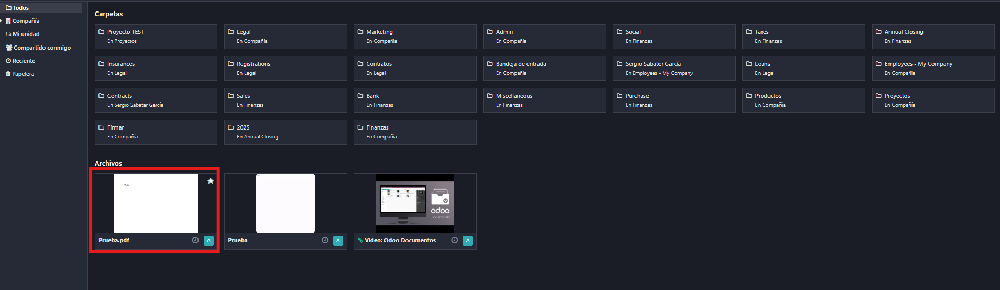
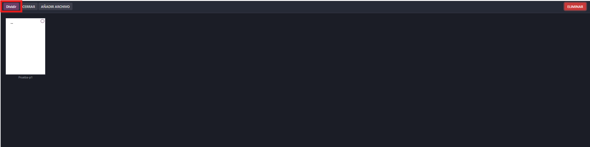
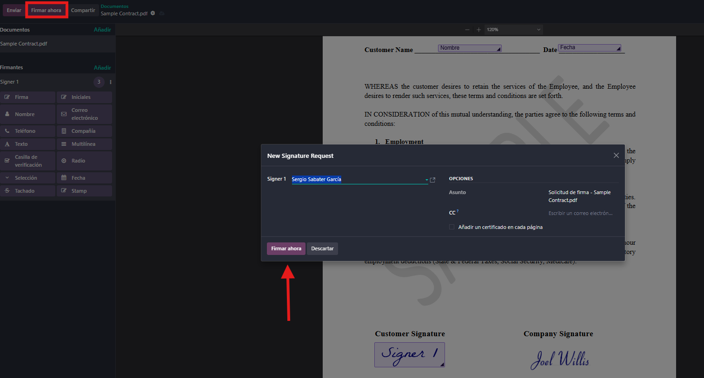
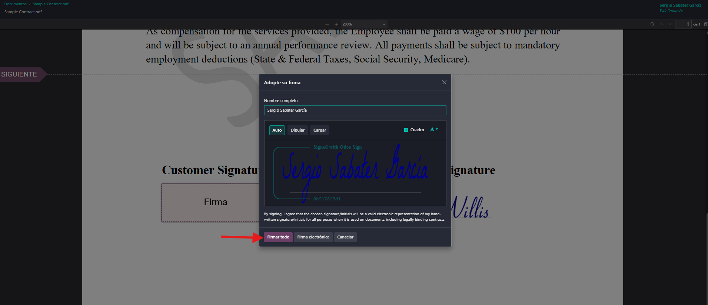
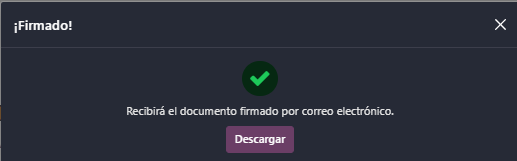
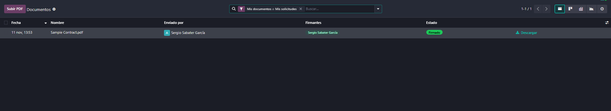

# 09 — Documentos, Firma e Información (Knowledge)

- **Documentos**: repositorio, edición hojas, dividir PDFs, etiquetas/flujo.
- **Firma electrónica**: campos (firma/nombre/fecha), envío y registro.
- **Información (Knowledge)**: wiki tipo Notion, permisos y publicación.

## Documentos

El propósito del módulo **Documentos** es eliminar el uso de archivos dispersos en correos o carpetas locales y centralizar toda la información documental de la empresa en un entorno seguro, ordenado y accesible.

### Repositorio

El módulo Documentos de Odoo funciona como un espacio digital donde se centraliza toda la documentación generada en la empresa. Su integración con otros módulos permite que los archivos creados en tareas, proyectos, ventas o recursos humanos se almacenen automáticamente en este entorno.

Los documentos pueden organizarse en carpetas temáticas, lo que facilita la clasificación por área, cliente o tipo de contenido.

Además, cada archivo puede etiquetarse con marcadores personalizados, que no solo ayudan a filtrar y buscar, sino que también pueden activar acciones automáticas. Por ejemplo, una etiqueta puede indicar que el documento debe enviarse al departamento contable o que requiere validación antes de ser compartido.

También es posible asignar un responsable o vincular el documento a un contacto específico, lo que permite mantener el control sobre quién debe revisarlo o actuar sobre él.

Este sistema convierte el módulo en una herramienta clave para mantener la trazabilidad documental, reducir el uso de papel y mejorar la colaboración entre equipos.

### Edición hojas

Odoo permite trabajar directamente con sus propias hojas de cálculo integradas, sin necesidad de descargar ni abrir archivos en aplicaciones externas.

* Al subir un archivo Excel, se puede abrir y editar desde el navegador usando las Hojas de cálculo de Odoo.
* Esta funcionalidad es ideal para trabajo colaborativo, ya que permite ver quién ha modificado qué, mantener el historial de cambios y evitar conflictos de versiones.
* Las hojas pueden vincularse a tareas, proyectos o documentos específicos, facilitando el análisis de datos en contexto.

### Dividir PDFs

El módulo incluye una herramienta práctica para dividir archivos PDF directamente desde la interfaz.

* Al seleccionar un documento PDF, Odoo muestra todas sus páginas en miniatura.
* El usuario puede elegir qué páginas conservar, separar o eliminar.
* Se pueden generar varios documentos nuevos a partir de uno solo, lo que facilita la gestión de contratos, facturas o informes extensos.

  Añadimos el PDF de prueba y hacemos clic sobre el documento.
  

  En la parte superior derecha, accedemos al menú "Acciones" donde aparece la opción "Dividir PDF".

  

  Tras seleccionar las páginas que queremos conservar o dividir, Odoo crea nuevos documentos independientes directamente desde el PDF original.

  

## Firma electrónica

El módulo Firma de Odoo permite gestionar la validación digital de documentos de forma rápida, segura y sin necesidad de impresión ni escaneo. Está integrado con el módulo Documentos, lo que facilita el envío, seguimiento y archivo de contratos, autorizaciones o formularios.

### Campos (firma/nombre/fecha)

Al preparar un documento para firma electrónica en Odoo, es posible insertar **campos dinámicos** que indican al firmante dónde debe completar la información requerida. Estos campos se añaden mediante una interfaz de arrastrar y soltar, lo que facilita su colocación precisa sobre el documento.

Arrastramos "Firma", "Nombre" y "Fecha" en los lugares correspondientes.

Le damos a "Firmar ahora"

Cuando le hacemos click a nombre y fecha se rellenan los datos automaticamente y seleccionamos donde hemos dejado la firma antes y si queremos podemos modificarla.

### Envío y registro

Una vez firmado el documento podemos descargar el documento.

El módulo de "Documentos" nos ayuda a tener un control de los documentos firmados.

- campos (firma/nombre/fecha), envío y registro.
- **Información (Knowledge)**: wiki tipo Notion, permisos y publicación.

