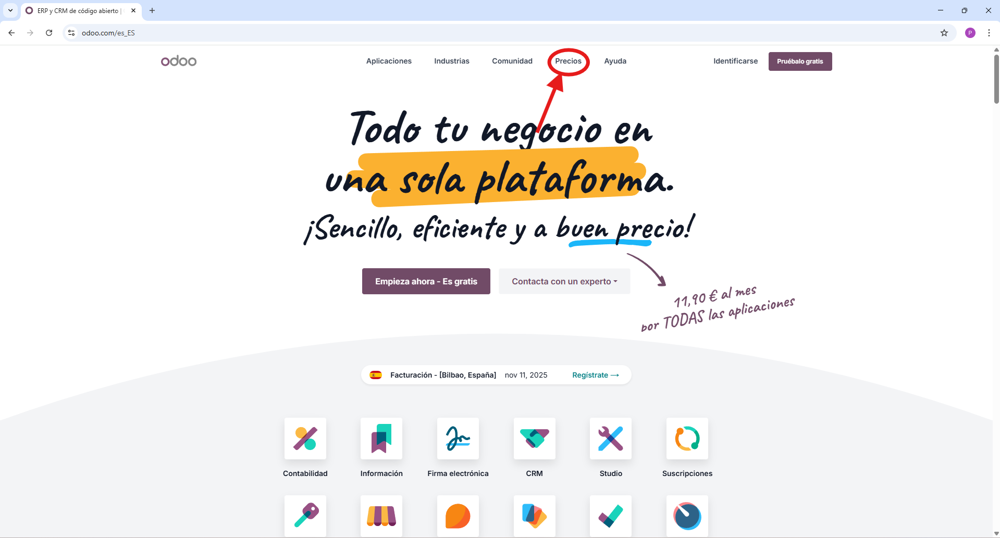
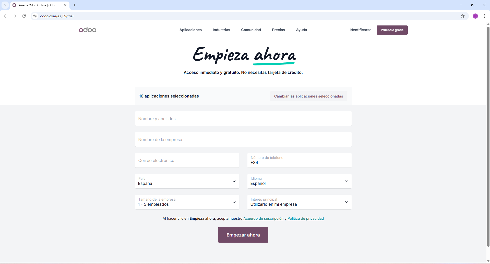
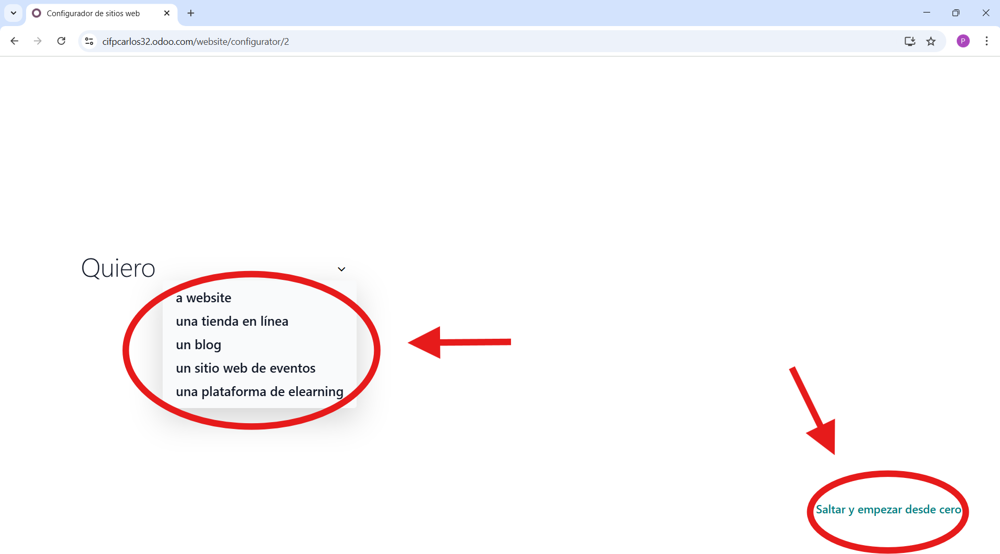
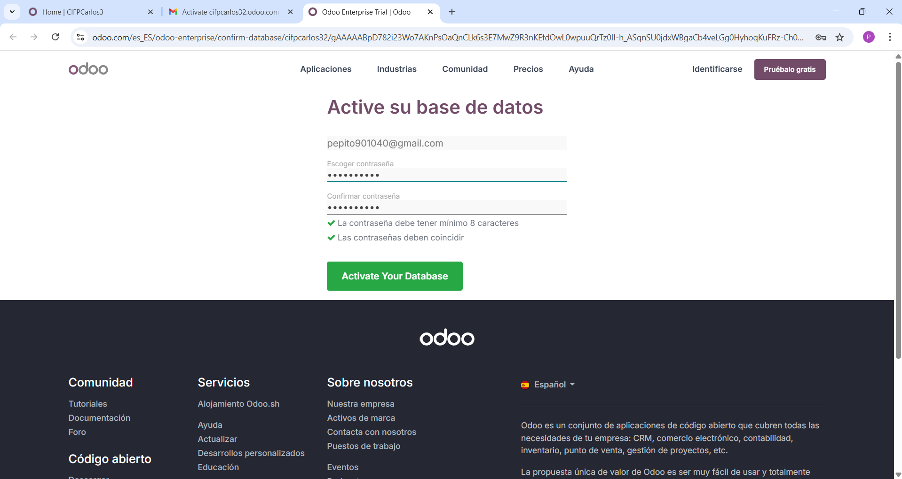
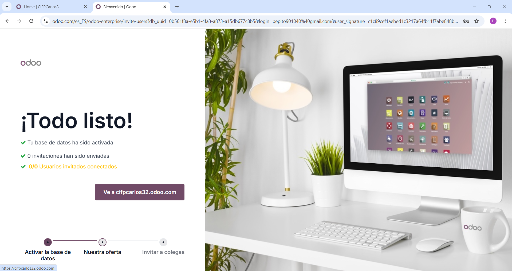

# 03 — Instalación y prueba (15 días) / Alta e instalación de apps

## Requisitos previos

- Navegador web (actualizado)

  - El alta y la versión de prueba de Odoo se realizan a través de la web, por lo que necesita un navegador moderno y actualizado (recomendado: Chrome, Edge o Firefox en su última versión).
  - Asegúrese de que JavaScript, cookies y ventanas emergentes estén permitidos para odoo.com; algunos flujos de activación usan enlaces que abren nuevas pestañas.
  - Compruebe la conectividad a Internet y que no haya proxies o bloqueos corporativos que impidan recibir el correo de activación.
- Cuenta de correo electrónico (válida y accesible)

  - Es imprescindible disponer de una cuenta de correo real para registrarse y activar la base de datos de prueba.
  - Recibirá un correo de activación que debe usar para confirmar la creación de la base de datos y establecer la contraseña de administrador.

## Pasos

### 1. Acceder a la Prueba Gratuita.

* Primero entramos a la página de Odoo y seleccionamos precios.
  
* Hay tres opciones, la gratuita, la estándar y la personalizada. Nosotros elegiremos la "Prueba gratuita" de la opción estandar.
  

### 2. Selección inicial de aplicaciones:

- Con la prueba gratuita nos dejan un límite máximo de 10 aplicaciones.
  
- Nosotros vamos a seleccionar las aplicaciones de:
  - CRM
  - Ventas
  - Facturación
  - Contabilidad
  - Proyectos
  - Documentación
  - Marketing por correo
  - Marketing social
  - Eventos
  - Sitio web.

* Tras elegir los módulos, haz clic en "Continuar".

### 3. Suministrar los datos: introduce tus datos personales y los de la empresa.

* Después de haberle dado a continuar nos aparecerá una ficha, la cual deberemos rellenar con nuestros datos y los datos de la empresa.
  
* Una vez rellenado todo con los datos necesarios le daremos a "Empezar ahora".

  

### 4. Activación de la base de datos.

* Una vez dado a "Empezar ahora" Odoo te dará la bienvenida y te preguntara que es lo que quieres hacer. Puedes marcar una de las opciones que te ponga o saltarte esta opción.
  
* Luego aparecerás en la pantalla principal y arriba a la derecha te pondra "Activación pendiente", esto es importante, ya que si no lo haces en un tiempo de 3 horas la base de datos se borrará automaticamente.
  
* Te llegara un correo al gmail que hayas puesto y te dira que le tienes que dar click a un boton.

  
* Luego te pedirá que escribas una contraseña de mínimo 8 caracteres.

  
* Y ya tendrías la base de datos activada.

  

### 5. Instalar/Desinstalar apps desde Aplicaciones.

* Para ver todas las aplicaciones que tienes, lo primero que tienes que hacer es ir al panel desde la pantalla de inicio.
  

  
* Una vez en el panel pulsamos donde dice "Aplicaciones"

  
* Y dentro de "Aplicaciones" puedes instalar, desinstalar y buscar (con la barra de búsqueda) aplicaciones.

  
* Para instalar un módulo, busca un módulo que no tengas y aparece un botón que pone instalar, haz click y se instala.

  
* Para desinstalar un módulo, le tienes que dar a los tres puntos de la aplicación que deseas desinstalar y te aparecerá la opción "Desinstalar", le das a esa opción y listo, módulo desinstalado. **¡¡CUIDADO!!** al desinstalar un módulo todos los datos que contiene se borrarán y se perderán.

  

## Resultado esperado

- Acceso al panel principal con las apps instaladas.
- Creación exitosa de la base de datos de prueba
- Posibilidad de instalar/desinstalar módulos según necesidades
