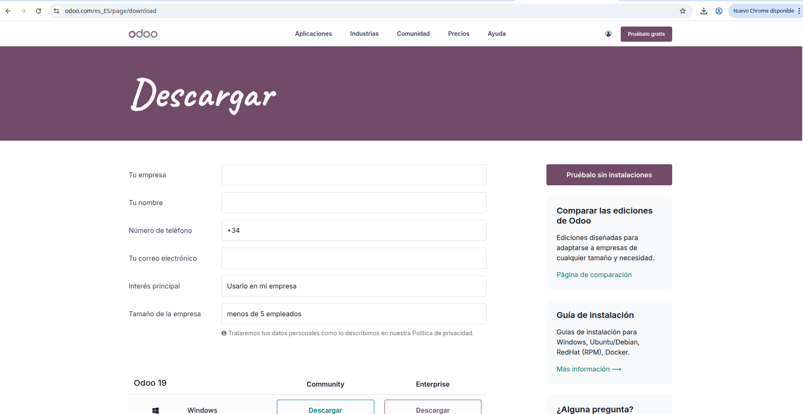
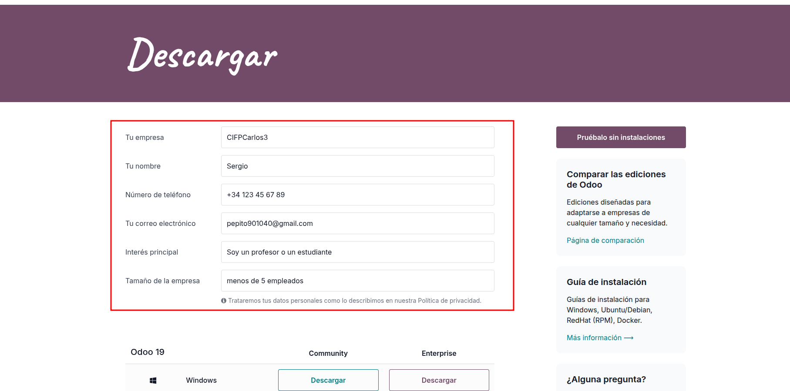
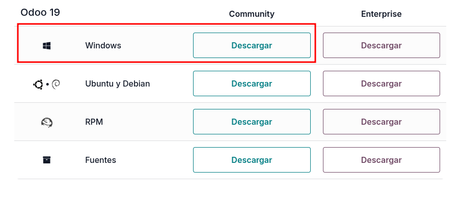

# 03 — Descarga del instalador de Odoo

## 1. Accede a la web oficial de Odoo y localiza el instalador para Windows.

Vamos a la [**web oficial de Odoo**](https://www.odoo.com/es_ES/page/download) y rellenamos los datos que nos piden. Luego de haber rellenado los datos abajo están todas las veriones disponibles. Nosotros nos descargaremos Odoo 19 Community para windows.

2. Descarga la **versión estable** que vayas a usar en clase (anota la **versión exacta**).
   - 

> Resultado esperado: fichero `Odoo-<version>-setup.exe` en tu equipo.
