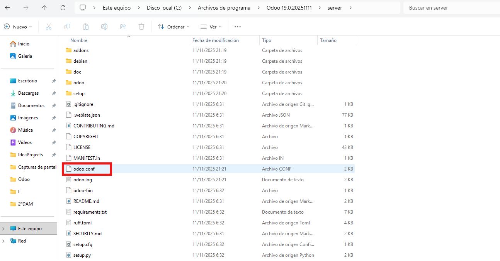
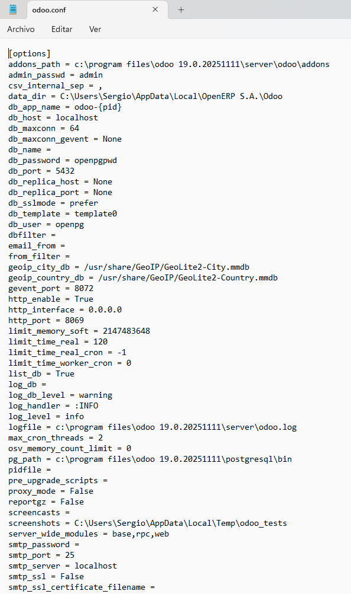
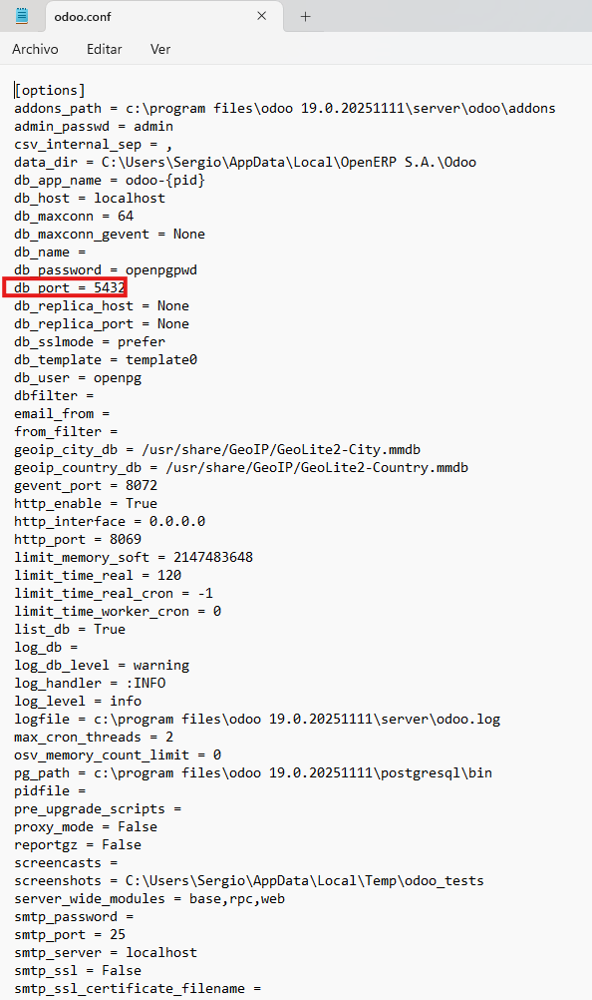
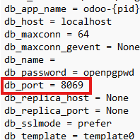

# 06 — Configuración inicial

1. Localiza archivos de **configuración** (si aplica) y el puerto por defecto (ej. `8069`).

   

   
2. Anota la **URL de acceso local** (p. ej., `http://localhost:8069`).

   
   

> Resultado esperado: parámetros básicos identificados/documentados.
