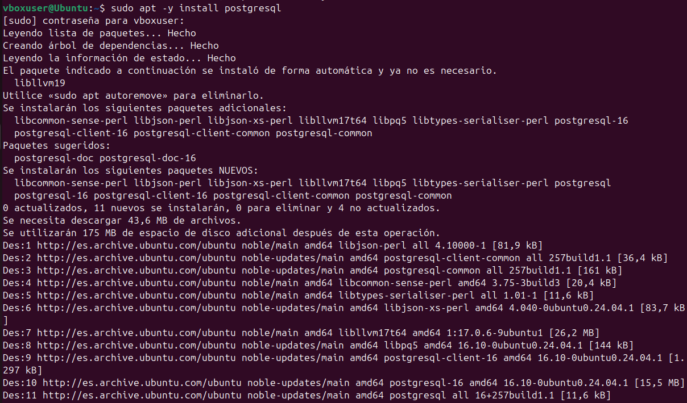
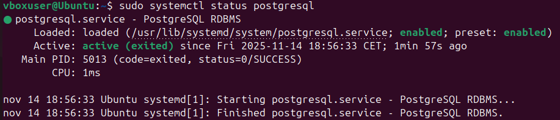
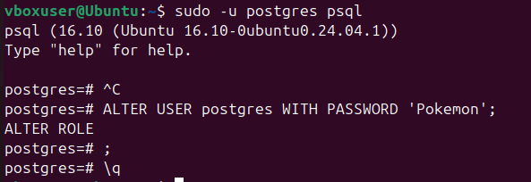

# 04 — PostgreSQL en Linux

1. Instala PostgreSQL desde repos:

   ```bash
   sudo apt -y install postgresql
   ```

   
2. Verifica el servicio:

   ```bash
   sudo systemctl status postgresql
   ```

   
3. Cambia contraseña del usuario `postgres`.

   

> Resultado esperado: PostgreSQL instalado y activo.
