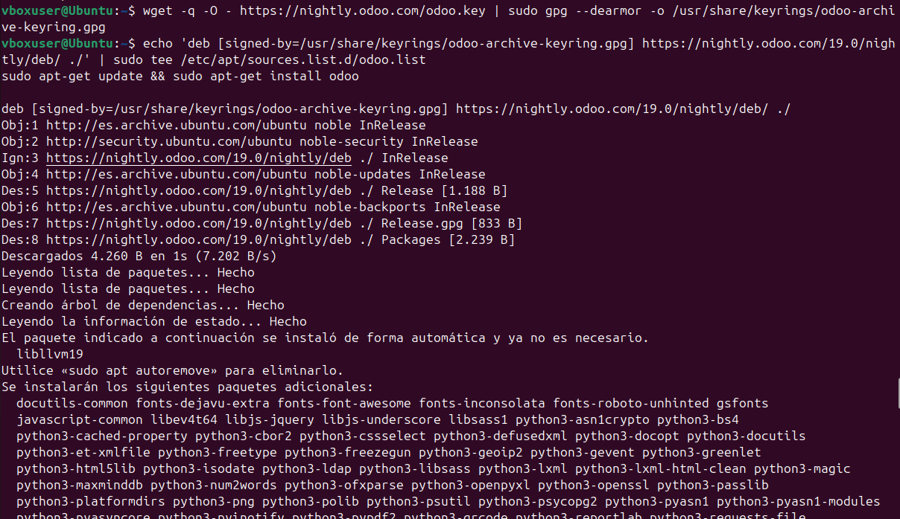
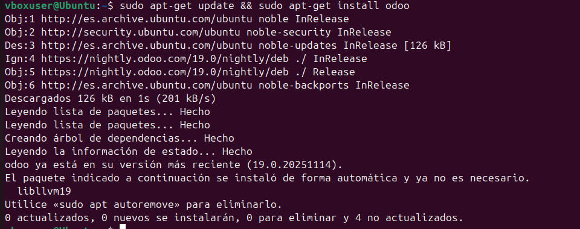

# 06 — Instalación de Odoo

> Elige uno de los métodos y documenta tu elección.

## Método A — Paquete oficial (repositorio Odoo)

1. Añade repositorio/clave y luego instala `odoo`:

   ```bash
   # (Ejemplo orientativo — ajusta a la versión que uses)
   sudo apt -y install odoo
   ```

   
   

> Resultado esperado: binarios/código de Odoo instalados.
