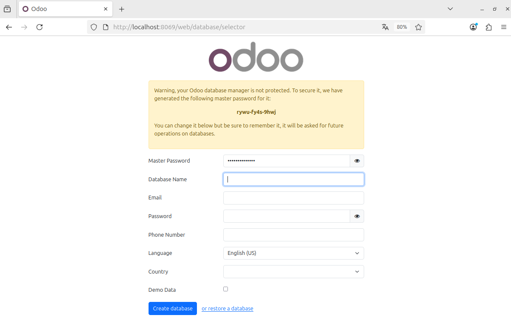
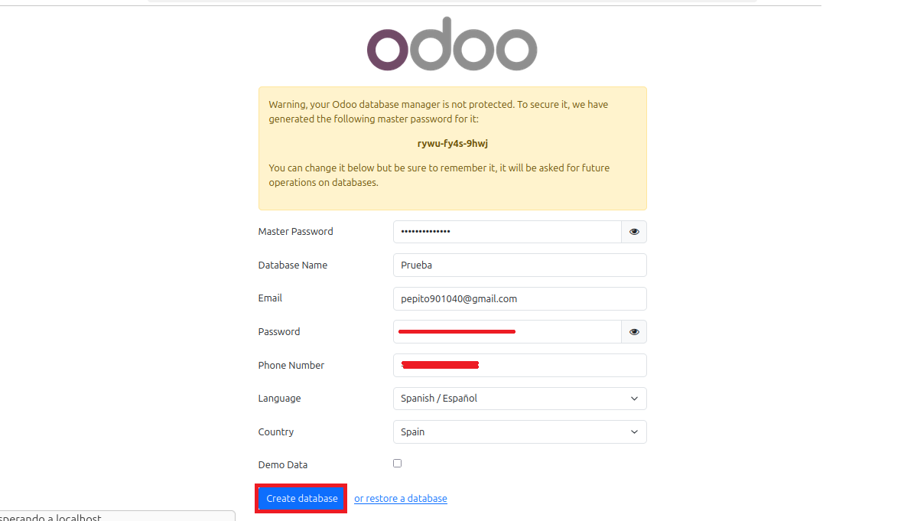
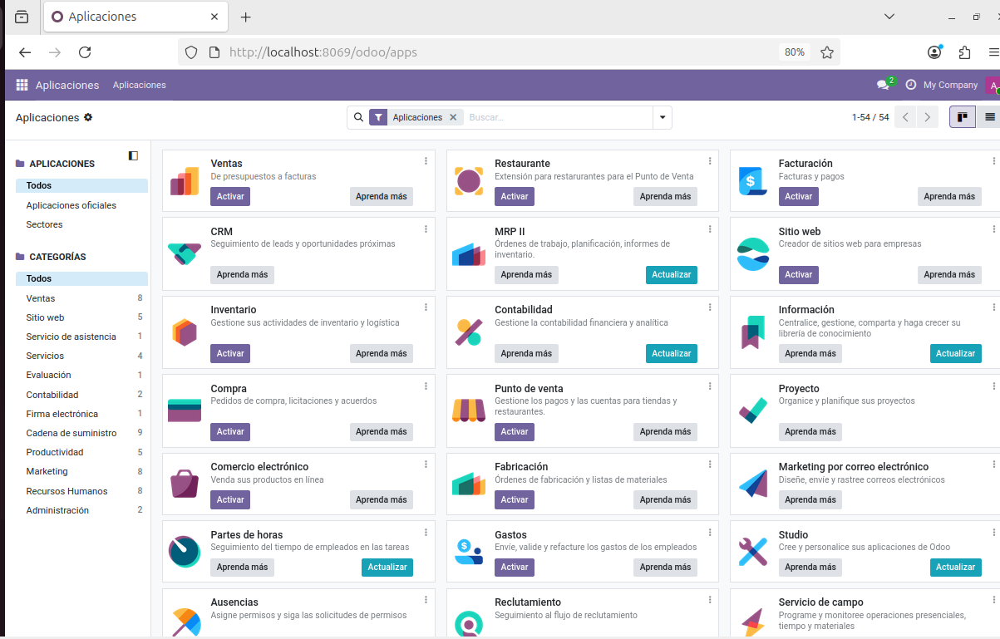

# 09 — Creación de base de datos de prueba

1. Accede a `http://localhost:8069`.

2. Crea una **base de datos nueva** con email/contraseña.

3. Selecciona módulos iniciales si procede.

> Resultado esperado: BD de prueba creada y primer acceso.
